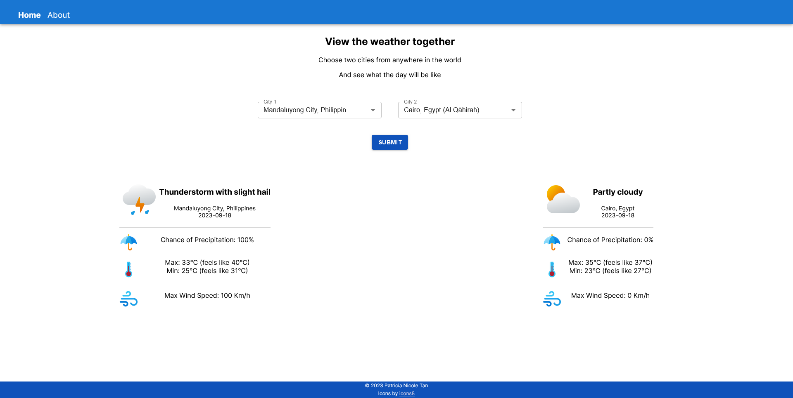

# weather-together-frontend

## Description
Frontend for Weather Together, a web app to view two cities' weather forecasts

## Instructions
To run the application locally, use ```npm run dev```. By default, the application runs at http://localhost:3000. Change the API calls to match.

## Linting
To run the linter and fix basic errors, use ```npm run lint -- --fix```.

## Screenshots
Screenshots from the live version on https://weather-together-web.netlify.app/

*The default page*


*Searching for a city*


*Before clicking "Submit"*


*Making the API call*


*Showing the final data*


